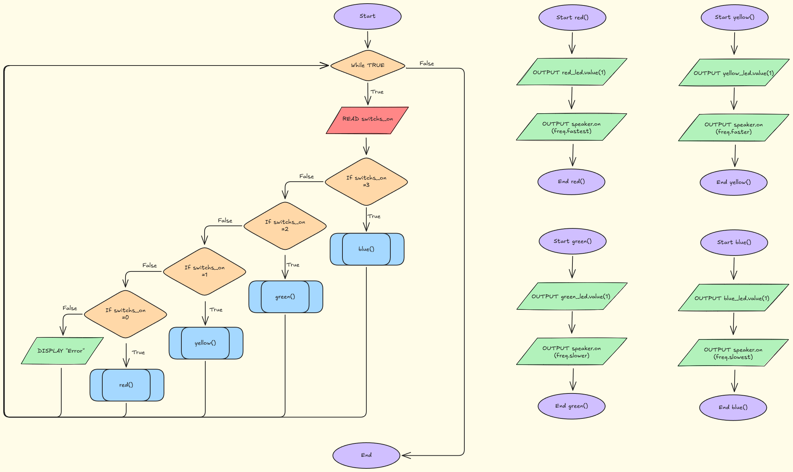
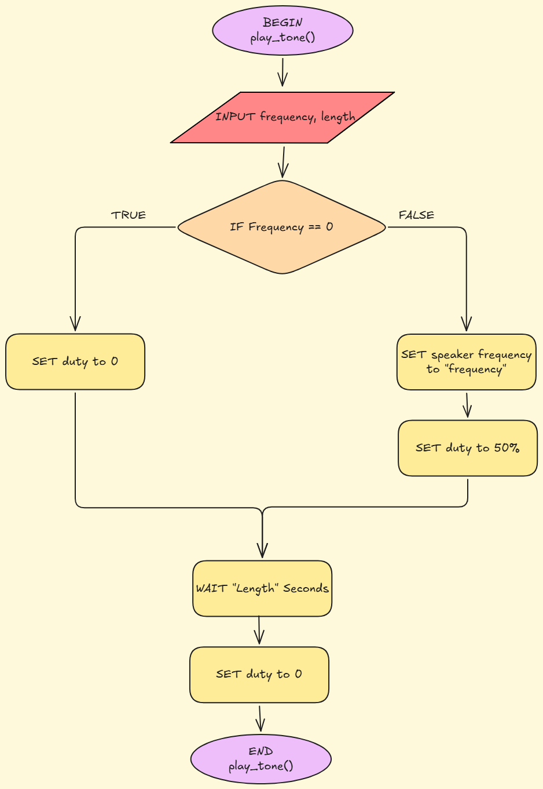

# Requirements Outline
### The Need 
Precision is a foundational aspect across industries such as construction, production, engineering, surveying, and techical trades. In these enviroments/work paces even deviations of a few degrees can compromise work flow in ways such as construction integraty, allighnment, safety, or downstream practcies. A misalignement of even 5° can:
- Cause structural components to sit incorrectly
- Lead to cumulative measurement errors
- Reduce the integrity of joints or welds
- Create unsafe load distributions
- Compromise the accuracy of machinery setups

Traditional levels rely on bubbles/secondary liquid suspended in amain liquid, leading to 3 main limitations:
- Low resoloution (the bubble only provides approixamet orientation) 
- No auditory feedback (users must maintain visual monotoring)
- Poor usability in low‑light or obstructed environments

In modern industry, the need for high precision orientation tools has increased significantly, giving birth to the digital level (a similar product to my proposed soloution). These industries all rely on tools which are able to provide:

- Higher resolution feedback (more than a liquid bubble can provide)
- Responsiveness (capable of detecting small angular changes)
- Multiple outputs (visual and auditory, for use in noisy or low‑visibility conditions, and to provide use ease)
- Hands‑free interpretability (allows workers to maintain focus on tasks)
- Fast sampling and real‑time correction (accuaracy)
- Repeatability (consistent readings across different environments)

### Proposed Soloution
I will design an eletronic level, which through use of a Raspberry Pi Pico Microcontroller, to process inputs from 3 differently orientated tilt switchs to accurately determine the orientation of the devise accurately. Then 4 LEDs (Red, Yellow, Green and Blue) as well as a buzzer will provide visual and auditory feedback to the orientation, witht the closer to flat, the faster the buzzer and LED beeps, as well as which LED beeping providing further feedback to the accuracy of orientation.

0-5° (Flat) - Buzzer and Blue LED beeping fastest
5-10° (Close to Fflat) - Buzzer and Green LED beeping faster
10-20° (Further from flat) - Buzzer and Yellow LED beeping slower
20+° (Far from flat) - Buzzer and Red LED beeping slowest

### Key Actions
#### Action 1 - Tilt switchs

3 tilt switches acts as binary sensors, acting as on/off switches depending on the orientation. By using three switches they are able to measure four specific angel ranges. Then communicating their status to the microcontoler, to than be combined for output. The sampling interval is as low as every 0.5 seconds while its orientation is far from flat, too as fast as a 0.0625 second sampling interval while it is closer to flat.

#### Action 2 - LEDs (Red, Yellow, Green, and Blue)
LEDs light up depending on angle range provided by tilt switches:

If between 0-5°, Blue LED beeps every 0.0625 seconds.

If between 5-10°, Green LED beeps every 0.125 seconds.

if between 10-20°, Yellow LED beeps every 0.25 seconds.

If above 20°, Red LED beeps every 0.5 seconds.

#### Action 3 - Buzzer
Simlilarily to LEDs, buzzer beeps depending on angle range provided by tilt switches, staying in time with LEDs:

If between 0-5°, Buzzer beeps every 0.0625 seconds.

If between 5-10°, Buzzer beeps every 0.125 seconds.

if between 10-20°, Buzzer beeps every 0.25 seconds.

If above 20°, Buzzer beeps every 0.5 seconds.


### Functional Requirments
### Tilt Switchs Input Functional Requirments:
- The system will be required to read on/off state of all 3 tilt switches at a sampling interval of as low as 0.0625 seconds, up to 0.5 seconds
- The system will be required to determine which of one of 4 angle ranges by combining on/off states of the 3 tilt switches
- The system will be required to store the detected angle range for use by the LEDs and Buzzer subroutine
#### LED Output Functional Requirments
- The system will be required to turn on one of the 4 LEDs (red, yellow, green, and blue) based on the detected angle range. Blue for 0–5°, Green for 5–10°, Yellow for 10–20°, and Red for above 20°.
- The system will be required to flash the active LED (red, yellow, green, or blue) at the assoociated interval for the detected range: 0.0625 seconds, 0.125 seconds, 0.25 seconds, or 0.5 seconds.
- The system will be required to flash the LED (red, yellow, green, or blue) synchronised with the buzzer timing for the same angle range.
#### Buzzer Output Functional Requirments
- The system will be required to create a beep whenever an angle range is detected
- The system will be required to beep at the the assoociated interval for the detected range: 0.0625 seconds, 0.125 seconds, 0.25 seconds, or 0.5 seconds.
- The system will be required to flash the buzzer synchronised with the LED timing for the same angle range.
### Test Case
| Test Case | Input     | Expected Output   |
|---------- |---------- |----------------   |
| >20° angle of device tilt sensor reading | 0/3 Tilt Switches On | |
| >10° angle of device tilt sensor reading | 1/3 Tilt Switches On | |
| >5° angle of device tilt sensor reading| 2/3 Tilt Switches On|  |
| <5° angle of device tilt sensor reading | 3/3 Tilt Switches On |  |
| Red LED | Placeholder Value of 0 ( 0/3 tilt switchs on) | |
| Yellow LED | Placeholder Value of 1 ( 1/3 tilt switchs on) | |
| Green LED | Placeholder Value of 2 ( 2/3 tilt switchs on) | |
| Blue LED | Placeholder Value of 3 ( 3/3 tilt switchs on) | |
| Red LED Buzzer Equivalent | Placeholder Value of 0 ( 0/3 tilt switchs on) | |
| Yellow LED Buzzer Equivalent | Placeholder Value of 1 ( 1/3 tilt switchs on) | |
| Green LED Buzzer Equivalent | Placeholder Value of 2 ( 2/3 tilt switchs on) | |
| Blue LED Buzzer Equivalent | Placeholder Value of 3 ( 3/3 tilt switchs on) | |
| Syncronization | | |
| | | |
| | | |
| | | |
| | | |
| | | |
### Non-Functional Requirments
**Efficiency:**

My device is required to operate its function efficienly, through use of optemsied code.

++

++

++

**Response Time** - My device is to take input every ≈0.1 seconds, and outputing immediatly

++

++

++

**Accuracy** - My devices input accuracy will be composd of my combined sensors which will be able to detect changes at 5° intervals 

++

++

++


# Design
### Flow Chart 
#### Main Function, 4 Output Functions

#### Speaker Function

### Pseudo Code
#### Main Function, 4 Output Functions, Speaker Function
```
BEGIN play_tone(frequency, length)

    IF frequency == 0 THEN
        SET speaker duty to 0
    ELSE
        SET speaker frequency to frequency
        SET speaker duty to 50%
    END IF
    WAIT for length seconds
    SET speaker duty to 0

END play_tone(frequency, length)

BEGIN
    WHILE true
        READ switchs_on
        If switchs_on == 0 THEN
            red()
        ELSE IF switchs_on == 1 THEN
            yellow()
        ELSE IF switchs_on == 2 THEN
            green()
        ELSE IF switchs_on == 3 THEN
            blue()
        ELSE
            DISPLAY "Error."
        ENDIF
    ENDWHILE

BEGIN red()
    OUTPUT red_led.value(1)
    OUTPUT speaker.on(freq.fastest)
END red()

BEGIN yellow()
    OUTPUT yellow_led.value(1)
    OUTPUT speaker.on(freq.faster)
END yellow()

BEGIN green()
    OUTPUT green_led.value(1)
    OUTPUT speaker.on(freq.slower)
END green()

BEGIN blue()
    OUTPUT blue_led.value(1)
    OUTPUT speaker.on(freq.slowest)
END blue()
```

# Development and Integration
## Documentation Reveiw
## Prototype
### Code & Comments
## First Attempt
# Testing and Debugging
## Test Cases
### Test Case 1 - <5° angle of device
#### Plan Outline
++

++
#### Code Adjustment and Testing
#### Evaluation
++

++

++

++

### Test Case 2 - >5° angle of device
#### Plan Outline
++

++
#### Code Adjustment and Testing
#### Evaluation
++

++

++

++

### Test Case 3 - >10° angle of device
#### Plan Outline
++

++
#### Code Adjustment and Testing
#### Evaluation
++

++

++

++

### Test Case 4 - >20° angle of device
#### Plan Outline
++

++
#### Code Adjustment and Testing
#### Evaluation
++

++

++

++

## Final Product
Working Product Video -> Attached Seperately in the google classroom turn in

Thonny / VS Code files and folder structure -> Attached to google classroom turn in

Test Cases -> Attached above in documentation

Commits -> Github & above in documentation
# Evaluation
## Peer Evaluation
Plus, Minus, Implication
### PMI 1
| Plus | Minus | Implication |
|---------- |---------- |----------------   |
|Peer Plus | Peer Minus | Peer Implication |
### PMI 2
| Plus | Minus | Implication |
|---------- |---------- |----------------   |
|Peer Plus | Peer Minus | Peer Implication |
## Self Evaluation
++

++

++

++

### Functional Criteria Evaluation
++

++

++

++

### Non-Functional Criteria Evaluation
++

++

++

++

### Performance for Identified Need Evaluation
++

++

++

++

### Project Management Evaulation
++

++

++

++

### Peer Evaluation Evaluation
++

++

++

++

### Future Impovments
++

++

++

++

